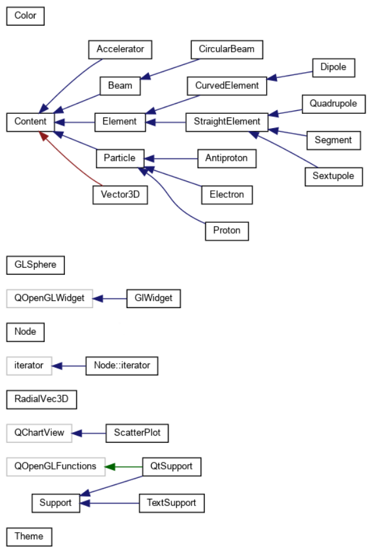

# Conception
### Hierarchie de class

La hierarchie est disponible dynamiquement dans la documentation doxygen, que l'on peut accéder
en lançant `doxygen` puis en ouvrant `./docs/html/index.html` avec votre navigateur libre préféré.
Le graphe est alors disponible dans `Classes > Class Hierachy`.

### Content et Support

Toutes les classes héritant de la classe `Content` sont des choses affichables.
La classe `Support` sert à afficher les `Content`. Elle a deux sous-classes,
`TextSupport`, qui permet d'afficher en mode texte, et `QtSupport`,
qui permet l'affichage graphique. Chaque instance de `Content` possède une méthode
`draw`, et le `Support` voulu doit être donné en argument. 
Cela diffère de la version proposée, car les `Content` ne possèdent pas de support.
Il y a deux avantages principaux : 
 - Cela permet, si on le souhaite, d'utiliser à la fois 
un affichage texte et un affichage graphique.
 - Il n'y a pas besoin de passer de `Support` à tous les constructeurs de `Content`

### Structure de l'accélerateur
L'accélérateur contient une liste doublement chaînée dont chaque nœud possède 
un `shared_ptr` vers une particule.
L'accélérateur possède également une liste de `unique_ptr` vers des éléments, ainsi qu'une
liste de `unique_ptr` vers des faisceaux. Utiliser des listes de pointeurs permet de faire
du polymorphisme et les `unique_ptr` nous assurent l'absence de fuites de mémoire.
Lors de la création de l'accélérateur, celui-ci est encore vide. 
Il est nécessaire par la suite d'appeler les méthodes pour ajouter les éléments, et `addBeam`, pour les faisceaux.
Nous avons choisi d'avoir des méthodes pour ajouter chaque type d'`Element` plutot 
qu'une méthode qui prend en argument un pointeur sur un élément afin de 
maintenir la cohérence des données (élément dont les entrées et sorties 
ne sont pas au même endroit, pas de le plan XY...).
Les faisceaux contiennent une liste de `shared_ptr` vers les particules
qu'ils ont créées.

### La liste doublement chaînée circulaire 

Nous avons choisi de ne pas implémenter les cases de p14 car elle nous semble trop gourmande 
en mémoire et nous avions envie de mettre nos capacités à l'épreuve afin de finir ce projet 
en beauté. Nous avons conceptualisé une SDA qui permet de résoudre le problème efficacement
en termes de mémoire et de complexité temporelle. Les particules sont ordonnées selon leurs 
positions longitudinales dans l'accélerateur et placées dans une liste doublement chainée 
pour que l'on puisse connaitre les voisins facilement. Le problème est qu'il faut maintenir 
l'ordre dans la liste, mais comme l'ordre est très stable et les particules ne font qu'échanger
leurs place deux à deux de temps en temps (avec un petit dt), "il suffit" d'inverser les 
particules deux à deux quand l'ordre change. On peut faire cela en une seule passe sur 
la liste et garder un ordre cohérent, nous avons donc une complexité temporelle en 
`O(nombre de particules)` pour garder l'ordre et pour appliquer les force, qui est le 
meilleur possible.

### Possession des particules

Les particules n'appartiennent à personne. Elles existent indépendamment de l'accélérateur
et des faisceaux. Nous avons fait ce choix car les particules doivent être accessibles par
l'accélérateur et par les faisceaux, même si elles n'existent plus pour l'uns ou l'autre. 
Lors de la création d'un faisceau, l'accélérateur appelle la méthode `generateParticles` 
du faisceau, en se mettant en argument. Le faisceau appelle alors la méthode `addParticle` de l'accélérateur, à chaque création de particule.

### Cacher les valeur souvent calculées

Pour les valeurs qui sont calculés frequement comme les positions radiales des particules
ou la longueur des éléments sont gardés en attributs et recalculés seulement quand
les grandeurs dont elles dépendent changent. Cela permet de faire beaucoup moins de calculs 
et gagner en vitesse, mais en contrepartie, nous utilisons plus de mémoire et il y a plus 
d'attributs dans le code dont il faut être sûr de la cohérence. 

### GlWidget
En mode graphique, la classe `GlWidget` gère l'affichage de la fenêtre et le déroulement
du programme. Elle contient l'accélérateur en attribut. L'accélérateur peut être créé avant
puis mis en argument à la création de l'instance de `GlWidget`
 même s'il ne peut pas être copié, car l'instance est déplacée avec std::move.
