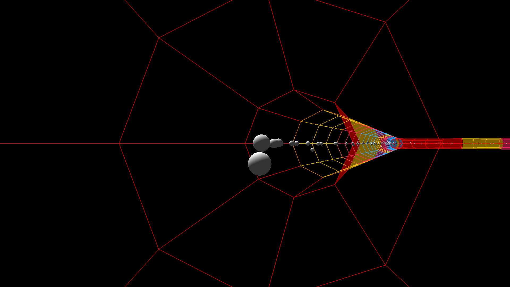
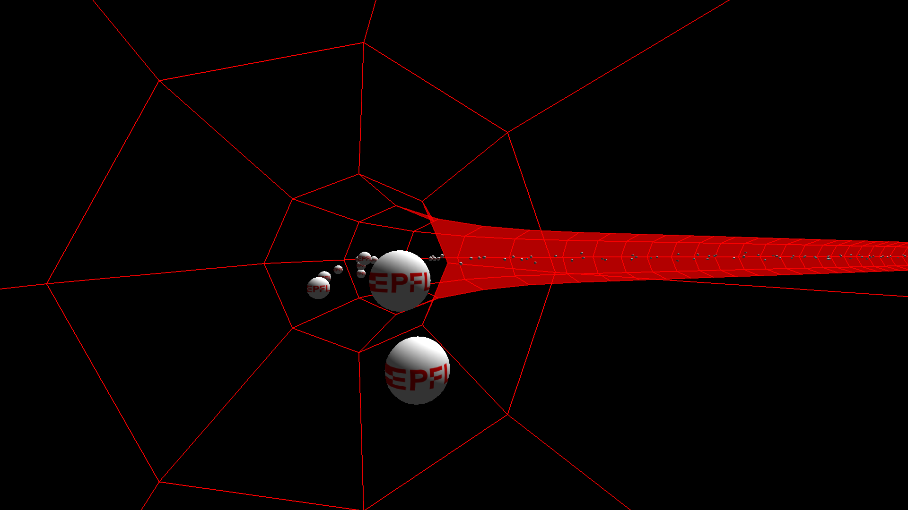

# Particle Accelerator
Par Gabin Kolly et Diego Dorn, 2019.

Ceci est notre projet de Programmation II à l'epfl. 
Il permet de simuler un accélérateur de particules,
constitué de dipôles, quadrupôles, sextupôles et de segments droits.
En moyenne, Gabin a travaillé 8h par semaine et
Diego 11h.

Nous avons fait toutes les parties de [la donnée](https://progmaph.epfl.ch/?content=projet/administration.php&today=2019-05-28&miniref=0&resume1=0&series1=0). Les parties additionnelles
que nous avons faites sont les sextupôles, une méthode pour ajouter des mailles
FODO et de super graphismes. 
De plus, nous avons mis en place, pour le calcul
des meilleurs voisins pour les interactions interparticules, une liste
doublement chaînée circulaire. Cette liste contient toutes les particules
triées selon la position longitudinale. Cela nous permet d'avoir 
une complexité moyenne en O(n) en temps comme en espace, car nous n'avons qu'à 
contrôler les particules les plus proches pour chaque particule,
et nous n'utilisons pas de mémoire inutile.

Nous avions également créé un graphe des positions radiales de chaque particule,
ainsi qu'un graphe leurs positions dans l'espace des phases position-vitesse.

### Compilation
Pour compiler, il faut C++14 ainsi que Qt5 pour la partie graphique. Le package `qt5-charts` sur Arch et `libqt5charts5-dev` sur Ubuntu est nécessaire pour voir les graphes des espaces de phase.
    
    git clone https://gitlab.com/ddorn/particle-accelerator
    cd particle-accelerator
    qmake && make && ./bin/qt-accelerator

##### Générer la documentation

La documentation du projet est faite avec doxygen, il suffit donc de lancer `doxygen`
puis `firefox docs/html/index.html` pour y accèder. In y trouve la documentation de la majorité des fonctions, ainsi que les arbres de [hierarchie de classes](./docs/html/inherits.html).
    
### Fonctionnement
L'accélérateur est constitué d'éléments, comme les dipôles. Il contient des faisceaux (ou beams), qui
permettent d'injecter les particules dans l'accélérateur, et de suivre différents paramètres, comme l'émittance.
Chaque faisceau possède une particule de référence, qui indique les caractéristiques moyennes des particules.
Ensuite, on fait avancer le système par petit pas de temps. On peut choisir entre un affichage texte et
un affichage graphique.

### Utilisation

Tout d'abord, il faut créer une instance d'accélérateur (class `Accelerator`). 
On ajoute ensuite les éléments les uns après les autres avec `addDipole`, `addFODO`... 
et enfin on ajoute des faisceaux (`addCircularBeam`). On peut ensuite faire évoluer le système
pas à pas. L'accélérateur doit être approximativement circulaire, centré à l'origine, être contenu dans
le plan xy et les éléments doivent être donnés en suivant le sens horaire.

### Interface graphique

##### Contrôles
De nombreux raccourcis permettent de se déplacer, ajouter des particules, ou changer la vue ou le theme. En voici une list exaustive.

Se déplacer (appuyer sur shift fait des plus petit pas et de plus grand angles) :
 - `A`: se déplacer a gauche
 - `D`: se déplacer a droite
 - `W`: se déplacer dans la direction de la camera
 - `S`: se déplacer dans la direction de la camera
 - `R`: se déplacer vers le haut
 - `F`: se déplacer vers le bas
 - `Q`: faire tourner la caméra dans le sens horaire
 - `E`: faire tourner la caméra dans le sens antihoraire
 - `fleches` faire tourner la caméra dans le sens de la flèche

Changer de mode de vue:
 - `Home`: revenir à la vue du dessus centrée
 - `1`: Vue à la première personne, à la place d'une particule 
 - `2`: Vue à la troisièle personne, derrière une particule 
 - `3`: Suivre un particule du dessus
 - `Esc`: Retourner en vue libre au même endroit que la dernière fois en vue libre
 - `Shift+Esc`: Retourner en vue libre, en restant à l'endroit actuel
 
Ajouter des particules:
 - `P`: Ajoute 42 protons dans le sens horaire
 - `Shift+P`: Ajoute 42 antiprotons dans le sens antihoraire
 - `BackSpace`: enlever toutes les particules et faisceaux
 
Controle de la simulation:
 - `J`: Faire une simulation de moins par frame (defaut: 5)
 - `K`: Faire une simulation de plus par frame (defaut: 5)
 - `Shift+J`: Faire 10 simulations de moins par frame
 - `Shift+K`: Faire 10 simulations de moins par frame
 - `Space`: Mettre en pause la simulation
 
Themes:
 - `Tab`: Passer au thème suivant
 - `Shift+Tab`: Passer au thème précédent
 
Genéral:
 - `G`: Ouvrir la fenetre avec les graphique de l'espace de phases (si compilé avec les charts)
 - `F11`: Inverser le mode plein écran
 
Controles pour les plots:
 - `1`: Plot de la position radiale (R versus Z)
 - `2`: Plot de la vitesse radiale (R versus Z)
 - `3`: Plot de l'espace des phases R (position R versus vitesse R)
 - `4`: Plot de l'espace des phases Z (position Z versus vitesse Z)
 
 

### Exemples

Le fichier `testModel.cpp`, dans le dossier `text`, est un exemple de simulation texte. L'accélérateur est constitué de quatre mailles FODO 
(avec des sextupôles après les quadrupôles) reliées ensemble par des dipôles.
Le fichier `test_qt.cpp`, dans le dossier qt, est un exemple de
interface graphique. Il reprend l'accélerateur de `testModel.cpp`.

### Problèmes et défauts
 Ce projet possède deux principaux problèmes. Le premier est que le générateur de hasard utilisé lors de la
 création des particules n'est pas réaliste, et ne permet pas simuler les distributions réelles des
 particules dans un accélérateur. Il n'a qu'un intérêt esthétique. Le second est une incohérence
 entre le repère radial utilisé pour le calcul des forces et de l'émittance, qui correspond à ce que
 l'on voit lors de l'affichage graphique, et la façon dont on détermine le passage d'un élément à un
 autre. Dans ce dernier cas, on suppose en effet que les éléments ont des bords qui pointent vers
 l'origine du repère cartésien. Cela cause des discontinuités lors de l'affichage
 de la vitesse radiale, en mode diagrame.

### Améliorations possibles
 Les améliorations possibles sont la mise en place d'une vraie simulation des distributions 
 des particules, ainsi que l'ajout d'éléments appliquant des forces électriques, 
 afin de réellement accélérer les particules.

### En savoir plus

Sur la conception du projet : [conception](CONCEPTION.md)

Sur l'evolution du projet : [journal](JOURNAL.md)

Sur les questions du cours : [reponses](REPONSES.md)

--- 
Le répertoire à été mis en public le mercredi 29 mai, après la date de rendu.
Nous avons donc respecté les instructions anti-tricherie.

Dans l'historique GIT, de nombreux commit sont mis au nom de Diego, alors qu'ils ont été
faits ensemble. En effet, nous avons plusieurs fois travaillé à deux sur l'ordinateur 
de Diego.
